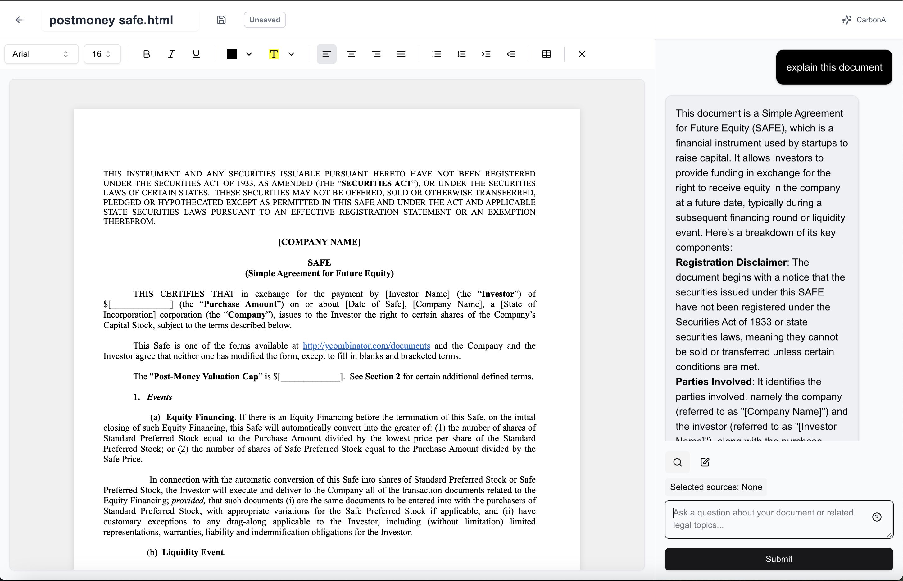
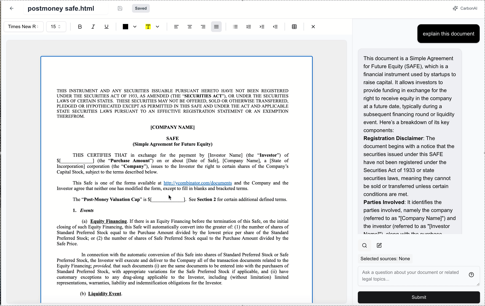
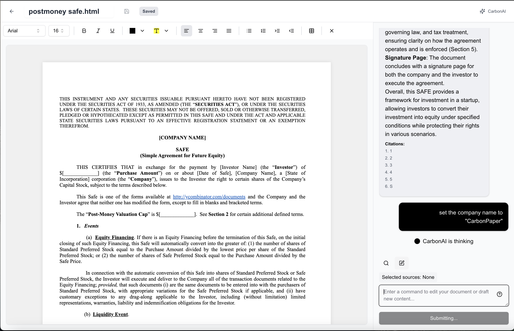

# CarbonPaper

<div align="center">
  
  <h3>Intelligent Document Editing with AI Assistance</h3>
</div>

<div align="center">

  
  
  

</div>

<div align="center">
  <strong>Transform your writing experience with AI-assisted editing, real-time collaboration, and powerful formatting tools.</strong>
</div>

<br />

<div align="center">
  <!-- Screenshot Placeholder: Main Editor Interface -->
  
</div>

## ✨ Features

### 🤖 AI Assistance (CarbonAI)

- **Intelligent Suggestions**: Get real-time suggestions for improving your content
- **Context-Aware Edits**: Intelligent editing that understands the context of your document
- **Custom Actions**: Define custom actions for specific editing needs
- **Interactive Chat**: Converse with AI to get answers about your document or related topics

<div align="center">
  <!-- Screenshot Placeholder: AI Assistant in action -->
  
</div>

### 📝 Rich Text Editor

- **Advanced Formatting**: Full text formatting capabilities including fonts, sizes, colors, and alignments
- **Tracked Changes**: See suggested changes with the ability to accept, reject or reprocess
- **Hover Actions**: Quick formatting toolbar that appears when text is selected
- **Seamless Editing**: Smooth, responsive editing experience with live updates

<div align="center">
  <!-- Screenshot Placeholder: Editor with formatting -->
  
</div>

### 📊 Document Management

- **File Explorer**: Easily manage multiple documents in one place
- **Auto-Save**: Automatic saving to prevent loss of work
- **Version History**: Track changes and revert to previous versions when needed
- **Export Options**: Export your documents in various formats

## 🚀 Getting Started

### Prerequisites

- Node.js 18.x or later
- Yarn or npm

### Installation

1. Clone the repository

```bash
git clone https://github.com/yourusername/carbonpaper-app.git
cd carbonpaper-app
```

2. Install dependencies

```bash
npm install
# or
yarn install
```

3. Create a `.env` file with the required environment variables:

```
OPENAI_API_KEY=your_openai_api_key_here
```

4. Start the development server

```bash
npm run dev
# or
yarn dev
```

5. Open [http://localhost:3000](http://localhost:3000) in your browser

## 💻 Usage Guide

### Creating a New Document

1. Navigate to the home page
2. Click on the "New Document" button
3. Start typing in the editor that appears

<div align="center">
  <!-- Screenshot Placeholder: Creating new document -->
  
</div>

### Using AI Features

1. Select text in the editor
2. Use the hover toolbar for quick AI actions, or
3. Click the "CarbonAI" button to open the AI assistant panel
4. Type your instructions or select from suggested prompts
5. Apply AI-suggested changes directly to your document

### Formatting Content

1. Select text in the editor
2. Use the toolbar at the top to apply formatting
3. Or use the hovering format bar for quick access to common formatting options

### Reviewing Suggested Changes

1. AI suggestions will appear as highlighted text
2. Hover over the suggestions to see options
3. Click "Accept" to keep the changes or "Reject" to discard them
4. Use "Reprocess" to get alternative suggestions

## 🛠️ Technology Stack

- **Frontend Framework**: [Next.js](https://nextjs.org/)
- **UI Components**: [Radix UI](https://www.radix-ui.com/) with custom styling
- **State Management**: React Hooks and Context
- **AI Integration**: OpenAI API
- **Text Editor**: Custom implementation using contenteditable
- **Styling**: Tailwind CSS with custom animations
- **Motion Effects**: Framer Motion

## 📘 API Reference

### CarbonAI API

CarbonPaper uses a custom AI processing endpoint that works with the OpenAI API.

**Endpoint**: `/api/process`

- **Method**: POST
- **Body Parameters**:
  - `input`: The user's input text
  - `editorContent`: The current content of the editor
  - `inputMode`: Either "question" or "edit"
  - `selectedSources`: Array of source references
  - `trackedChanges`: (Optional) Current tracked changes

**Response**:

- For questions: Returns a text response with optional citations
- For edits: Returns suggested changes with tracked changes information

## 🤝 Contributing

Contributions are welcome! Please feel free to submit a Pull Request.

1. Fork the repository
2. Create your feature branch (`git checkout -b feature/amazing-feature`)
3. Commit your changes (`git commit -m 'Add some amazing feature'`)
4. Push to the branch (`git push origin feature/amazing-feature`)
5. Open a Pull Request

## 📄 License

This project is licensed under the MIT License - see the LICENSE file for details.🙏 Acknowledgements

- [OpenAI](https://openai.com/) for powering the AI features
- [Vercel](https://vercel.com/) for hosting
- [Radix UI](https://www.radix-ui.com/) for accessible UI components
- All open-source contributors whose libraries made this project possible
